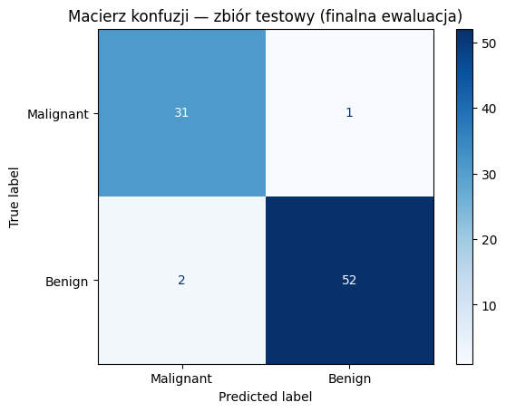

# Breast Cancer Classification — MLP Neural Network

Klasyfikator nowotworów piersi oparty na sieci neuronowej (MLP). Projekt zbudowany w oparciu o dataset Wisconsin Breast Cancer z biblioteki scikit-learn.

Głównym celem nie była maksymalizacja accuracy, ale **minimalizacja fałszywych negatywów** czyli przypadków gdy model błędnie uznaje złośliwy guz za łagodny. Stąd Recall jako metryka wiodąca.

---

## Wyniki końcowe

| Metryka | Wartość |
|---|---|
| Accuracy | 96.5% |
| Recall - Malignant | 96.9% |
| Precision - Malignant | 94.1% |
| F1-Score | 95.3% |

Dla porównania - naiwna klasyfikacja (zawsze Benign) daje 62.8%. 

---

## Struktura

```
breast_cancer_nn/
├── notebooks/
│   └── exploration.ipynb   # EDA
├── src/
│   └── model.py            # preprocessing, trening, ewaluacja
├── results/
│   └── plots/              # wykresy z EDA i macierze konfuzji
└── README.md
```

---

## Dataset

Breast Cancer Wisconsin Diagnostic - 569 próbek, 30 cech numerycznych opisujących właściwości jąder komórkowych (m.in. promień, tekstura, wklęsłość).

Podział klas: 212 Malignant / 357 Benign. Lekka nierównowaga, ale niewymagająca dodatkowych technik jak SMOTE.

---

## Co i dlaczego

**EDA** - zanim dotknąłem modelu, spędziłem czas na zrozumieniu danych. Heatmapa korelacji pokazała silne zależności między wariantami `mean` i `worst` tych samych cech, co sugerowało redundancję. Histogramy i boxploty z podziałem na klasy ujawniły że `mean concave points` i `mean perimeter` najlepiej separują klasy — co potem potwierdziło się w działaniu modelu.

**Preprocessing** - podział 70/15/15 ze stratyfikacją, `StandardScaler` fitowany wyłącznie na zbiorze treningowym. Klasyczny pipeline, ale ważne żeby nie robić fit_transform na walidacji i teście.

**Modelowanie** - startowałem od prostego `MLPClassifier(hidden_layer_sizes=(64,))`. Potem Grid Search po 48 kombinacjach architektury, funkcji aktywacji, regularyzacji i learning rate. Wynik: baseline był już optymalny. Czasem tak jest — problem nie zawsze wymaga skomplikowanego rozwiązania.

**Ewaluacja** - zbiór testowy dotknięty tylko raz, na samym końcu.

---

## Uruchomienie

```bash
git clone https://github.com/KaliKacp/Breast-Cancer-NN.git
cd Breast-Cancer-NN

python -m venv .venv
source .venv/bin/activate
pip install scikit-learn numpy pandas matplotlib seaborn jupyter

python src/model.py
```

---

## Technologie

Python 3.12 · scikit-learn · pandas · matplotlib · seaborn · Jupyter

---

## Macierz konfuzji — zbiór testowy


